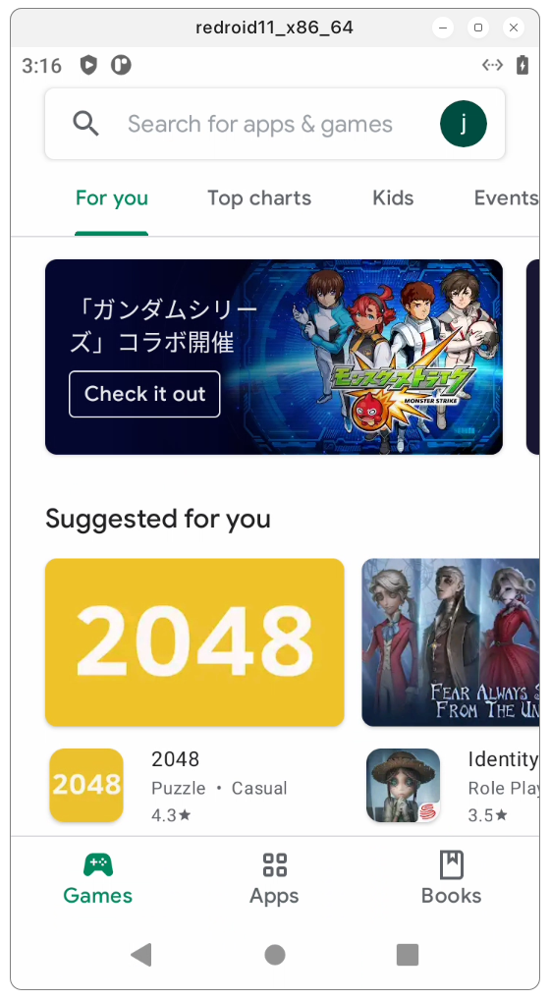
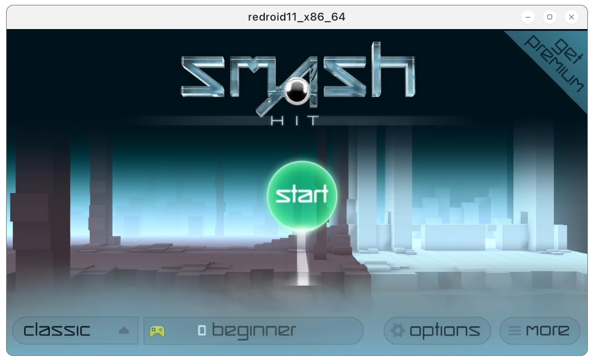
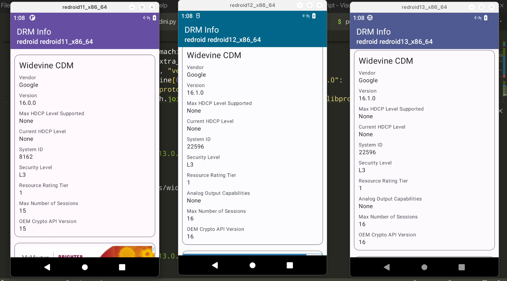

# Remote-Android Script

This tool enables additional modules to be added to a redroid image without necessitating the recompilation of the entire image. 

It supports cross-compilation for creation of arm64 images on amd64 hosts and vice versa.

If redroid-script doesn't work, please create an issue.

## Dependencies

This project depends on the following native dependencies:

- Python >= 3.11
- [`lzip`](https://packages.fedoraproject.org/pkgs/lzip/lzip/)
- [`docker-cli`](https://packages.fedoraproject.org/pkgs/moby-engine/docker-cli/)

It also has an array of python dependencies.

Please make a virtual environment and install the dependencies from `requirements.txt`.

Please also note that although this tool requires `docker` with the `buildx` plugin, other container systems `podman` can also be used if a package like [`podman-docker`](https://packages.fedoraproject.org/pkgs/podman/podman-docker/) is installed that provides the docker CLI to a non-docker backend.

## Configuration

All supported options can be viewed with:

```bash
python3 -m rds --help
```

As of writing, this yields:

```bash
usage: python3 -m rds [-h] [--redroid-image REDROID] [--android-version ANDROID] [--architecture {arm64,amd64}] [--gapps {litegapps,opengapps,mindthegapps}] [-n] [-w]

options:
  -h, --help            show this help message and exit
  --redroid-image REDROID
                        Base image of redroid, excluding any tags. Your docker/podman daemon must be autheticated against this source. Docker hub allows anonymous access, however it is rate limited.
  --android-version ANDROID
                        Specify the Android version to build. See valid versions on the tags page of Redroid https://hub.docker.com/r/redroid/redroid/tags
  --architecture {arm64,amd64}
                        Specify the architecture you'd like to build the final image for. Does not need to match the host you're running on, but the default is the build host's arch.
  --gapps {litegapps,opengapps,mindthegapps}
                        Installs a GMS provider into the final image. You will need to experiment to find the best provider for you.
  -n, --install-ndk-translation
                        Install libndk translation files
  -w, --install-widevine
                        Integrate Widevine DRM (L3)
```

## Add GMS to ReDroid image

This project can install various GMS implementations into the redroid images.

Currently supported:

- OpenGapps (Limited support)
- LiteGapps
- MindTheGapps



## Add libndk arm translation to ReDroid image



libndk_translation from guybrush firmware.

libndk seems to have better performance than libhoudini on AMD.

## Add Magisk to ReDroid image

This project previously supported adding Magisk to the redroid image. This functionality has been removed due to the security implications of exposing root to untrusted processes, which is likely in a remote environment.

## Add widevine DRM(L3) to ReDroid image

Adding Widevine will allow the android device to play some DRM-enabled copyrighted media. Your milage will vary, as different publishers require different levels of Widevine compliance.



## Example

This command will add OpenGapps, LibNDK translation, and Widevine to the ReDroid image at the same time.

```bash
python3 -m rds --android 11.0.0-latest --gapps opengapps -nw
```

Then start the docker container.

```bash
docker run -itd --rm --privileged \
    -v ~/data:/data \
    -p 5555:5555 \
    redroid/redroid:11.0.0_patched_opengapps_ndk_widevine-latest \
ro.product.cpu.abilist=x86_64,arm64-v8a,x86,armeabi-v7a,armeabi \
    ro.product.cpu.abilist64=x86_64,arm64-v8a \
    ro.product.cpu.abilist32=x86,armeabi-v7a,armeabi \
    ro.dalvik.vm.isa.arm=x86 \
    ro.dalvik.vm.isa.arm64=x86_64 \
    ro.enable.native.bridge.exec=1 \
    ro.vendor.enable.native.bridge.exec=1 \
    ro.vendor.enable.native.bridge.exec64=1 \
    ro.dalvik.vm.native.bridge=libndk_translation.so \
    ro.ndk_translation.version=0.2.3 \
```

If you need to use libndk on `redroid:12.0.0_64only-latest` image, you should start the container with the following command

```bash
docker run -itd --rm --privileged \
    -v ~/data:/data \
    -p 5555:5555 \
    redroid/redroid:12.0.0_64only_patched_ndk_widevine-latest \
    androidboot.use_memfd=1 \
    ro.product.cpu.abilist=x86_64,arm64-v8a \
    ro.product.cpu.abilist64=x86_64,arm64-v8a \
    ro.dalvik.vm.isa.arm64=x86_64 \
    ro.enable.native.bridge.exec=1 \
    ro.dalvik.vm.native.bridge=libndk_translation.so
```

## Troubleshooting

- The device isn't Play Protect certified
    1. Run below command on host
    ```
    adb root
    adb shell 'sqlite3 /data/data/com.google.android.gsf/databases/gservices.db \
    "select * from main where name = \"android_id\";"'
    ```

    2. Grab device id and register on this website: https://www.google.com/android/uncertified/
- Redroid doesn't work on Fedora/RHEL/downstream like Rocky
    ashmem & memfd are not included in the kernels these distributions provide. Please see the documentation of `redroid` for ways around this. For convenience's sake, the use of the latest Ubuntu LTS version is reccomended. 

## Credits
1. [remote-android](https://github.com/remote-android)
2. [waydroid_script](https://github.com/casualsnek/waydroid_script)

